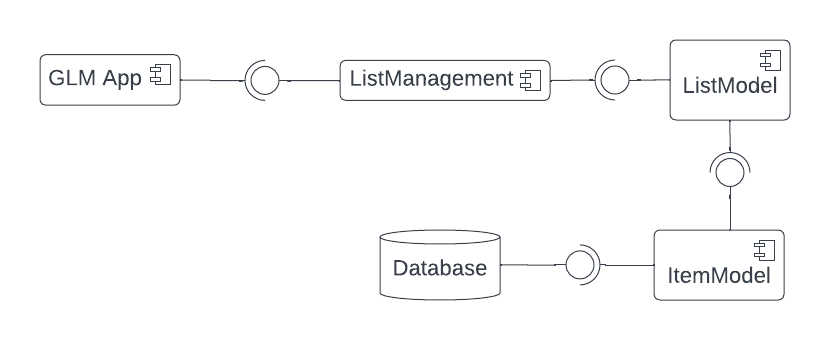
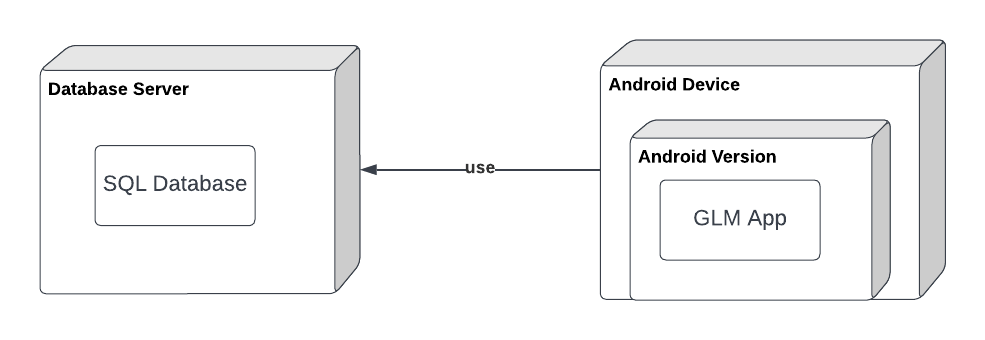
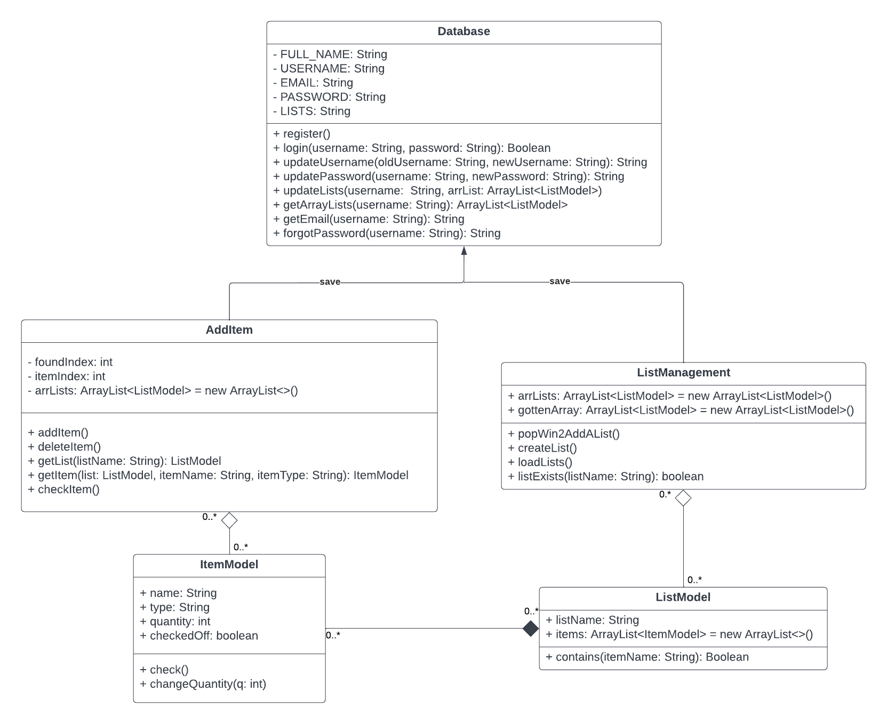
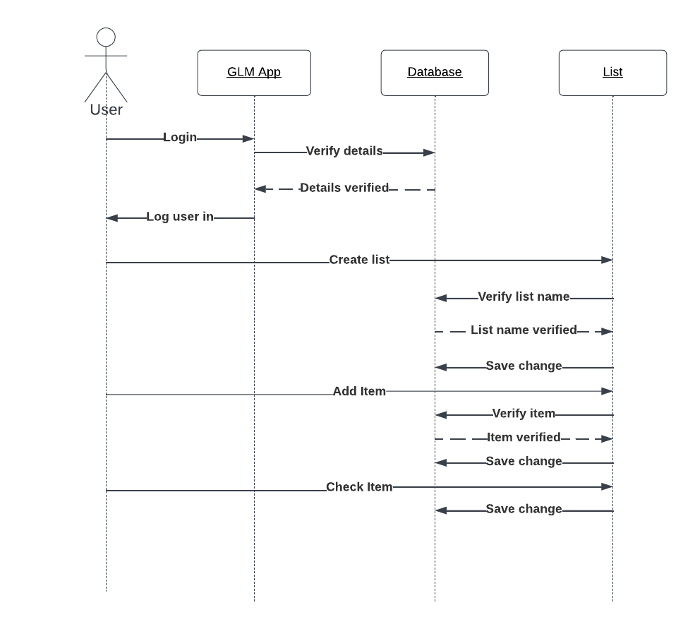
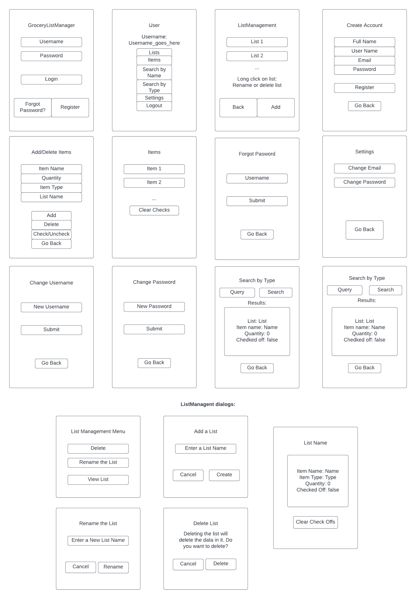
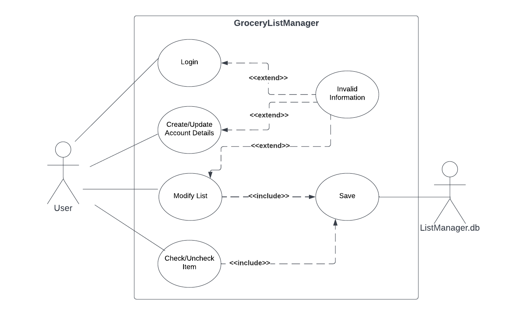

# Android Application: Grocery List and Management
**Authors**: 
Alyssa Ayala, Juan C.Bermeo, Zheng Huang, Hongtao Jiang, Rongxin Yang
# Project Plan

## 1 Introduction

We are planning to develop an Android app, *GroceryListManager*, to manage grocery lists in grocery stores. This app can hold multiple users and multiple lists for each user. Below are the details of our project.

## 2 Process Description

#### Activity 1

*Activity name*: Add/Delete Items

*Activity description*: Add items/types, delete items/types, and check/uncheck items to your lists. Also update quantities of items in lists.

*Entrance criteria*: Click the "ITEMS" button from the User activity page.

*Exit criteria*: Click the "GO BACK" button; you'll be back at the User activity page.

#### Activity 2

*Activity name*: Forgot Password

*Activity description*: Get an email with your password by entering your username.

*Entrance criteria*: Click on the "FORGOT PASSWORD?" text from the Login activity page.

*Exit criteria*: Click the "GO BACK" button; you'll be back at the Login activity page.

#### Activity 3

*Activity name*: List Management

*Activity description*: Add/name/delete lists, view the contents of those lists, and clear all check offs at once.

*Entrance criteria*: Click the "LISTS" button from the User activity.

*Exit criteria*: Click the "GO BACK" button; you'll be back at the User activity page.

#### Activity 4

*Activity name*: Login

*Activity description*: Log into your GroceryListManager account.

*Entrance criteria*: Open/restart the app. This is the main activity; this will come up first.

*Exit criteria*: Either click on the "FORGOT PASSWORD?" text, the "CREATE ACCOUNT" text, or logout of the app with the "LOGIN" button from the User activity page.

#### Activity 5

*Activity name*: List Management

*Activity description*: Add/name/delete lists, view the contents of those lists, and clear all check offs at once.

*Entrance criteria*: Click the "LISTS" button from the User activity.

*Exit criteria*: Click the "GO BACK" button; you'll be back at the User activity page.

#### Activity 6

*Activity name*: Create Account

*Activity description*: Create a GroceryListManager account.

*Entrance criteria*: Click the "CREATE ACCOUNT" text from the Login activity page.

*Exit criteria*: Click the "GO BACK" button; you'll be back at the Login activity page.

#### Activity 7

*Activity name*: Search by Name

*Activity description*: Search for an item by typing its name.

*Entrance criteria*: Click the "SEARCH BY NAME" button from the User activity page.

*Exit criteria*: Click the "GO BACK" button; you'll be back at the User activity page.

#### Activity 8

*Activity name*: Search by Type

*Activity description*: Search for an item by typing its type.

*Entrance criteria*: Click the "SEARCH BY TYPE" button from the User activity.

*Exit criteria*: Click the "GO BACK" button; you'll be back at the User activity page.

#### Activity 9

*Activity name*: Settings

*Activity description*: Change your username or password.

*Entrance criteria*: Click the "SETTINGS" button from the User activity.

*Exit criteria*: Click the "GO BACK" button; you'll be back at the User activity page.

#### Activity 10

*Activity name*: Change Username

*Activity description*: Change your account's username.

*Entrance criteria*: Click the "CHANGE USERNAME" button from the Settings activity page.

*Exit criteria*: Click the "GO BACK" button; you'll be back at the Settings activity page. 

#### Activity 11

*Activity name*: Change Password

*Activity description*: Change your account's password.

*Entrance criteria*: Click the "CHANGE PASSWORD" button from the Settings activity page.

*Exit criteria*: Click the "GO BACK" button; you'll be back at the Settings activity page.

#### Activity 12

*Activity name*: User

*Activity description*: The main page you'll see when you log in. Contains all options on how to manage your lists.

*Entrance criteria*: Different ways:
  - Login from the Login activity page.
  - Press the "GO BACK" button from the Lists, Items, Search by Name, Search by Type, or Settings activity pages.

*Exit criteria*: Different ways:
  - Logout by pressing the "BACK BUTTON" on the page; you'll be back at the Login apge.
  - Press the "LISTS", "ITEMS", "SEARCH BY NAME", "SEARCH BY TYPE", or "SETTINGS"; you'll be at either of these respective activities.

## 3 Team

**Roles:** 

- **Project manager**: The person overall responsible for the planning and execution of a project, and submit project.

- **Developer**: Write the applications that run on Android devices. 

- **Designer**: Design the application's outline. 

- **Documenter**: Write documents for the project. 

- **Verifier**: Test the project to debug and improve the project. 

| Name          | Role(s)                                |
| ------------- | -------------------------------------- |
| Alyssa Ayala  | Developer, Documenter, Project manager |
| Juan Bermeo   | Developer, Documenter, Design          |
| Zheng Huang   | Developer, Documenter, Verifier        |
| Hongtao Jiang | Developer, Documenter, Verifier        |
| Rongxin Yang  | Developer, Documenter, Design          |

# Design Document

## 1 Design Considerations

### 1.1 Assumptions

The user should have an Android phone and downloads the *GroceryListManager* application.  

### 1.2 Constraints

The app does not support systems other than Android. Cannot share with other users.

### 1.3 System Environment

This app runs on Android devices with a minimum API level of 21.

## 2 Architectural Design

### 2.1 Component Diagram

GLM App component uses the services of ListManager component.

ListManagement component uses the services of List component.

ListModel component uses the services of Item component.

ItemModel component uses the services of database.

### 2.2 Deployment Diagram

The data is stored in Database Server by using SQL database. 

The Android device contains an Android version, which runs the GLM app.

## 3 Low-Level Design

### 3.1 Class Diagram

### 3.2 Other Diagrams (Sequence)

This is sequence diagram that shows some actions that users can do in our application.

## 4 User Interface Design

# Supplementary requirements

- Each item must be organized into different types for the user to search through. All of the items under that type across multiple lists should appear in the search results.

- Users must also be able to search for an item by name. Multiple items may pop up if there are items with the same name but different types. They may be in either the same list or different lists.

- The user must be able to change their username and password to their account.

- When creating a new account, the user should be prompted to give a full name, username, email, and password.

- If the user forgets their password, they should be able to receive an email with their password in it. 

- When adding a new item, the user will be asked for the name, quantity type, and list name. If it doesn't already exist, it'll be automatically created. If it already exists, it'll be updated.

- The user is able to go back to where they were by pressing the "GO BACK" button on applicable activity pages.

- In addition to the list database, there should be a ListModel and ItemModel class to represent lists and items, where each list holds an array of items, and each item has a type associated with it. 

- Any required fields should not be left empty. When modifying a list, it must already exist. Anything being deleted should already exist. Lastly, anything that is being created must not exist yet. If any of these conditions are not satisfied, the requested action will not be done and will instead give an error message.

# Use Case Model
## 1 Use Case Diagram

## 2 Use Case Descriptionse
### Login
- Requirements: When opening the app, the user must log into their account with a username and password.
- Pre-conditions: The given username and password must be correct.
- Post-conditions: The user will be logged into their account and taken to the "User" page..
- Scenarios: If the user gives the correct username and password, the user will be logged in. Otherwise, an error will come up. The user has the option to receive an email to get their password if they forgot it.

### Create/Update Account Details
- Requirements: The user must be able to register for an account in the app.
- Pre-conditions: The username must not be associated with an account yet.
- Post-conditions: The user now has an account in the app.
- Scenarios: If the username does not already exist, the account will be created. Otherwise, an error message will come up. A user can also choose to change their username or password while logged in.

### Modify List
- Requirements: The user must be able to modify their lists and the items/types in them.
- Pre-conditions: The requested change either does not exist already or does not interfere with any other lists.
- Post-conditions: The lists have been modified.
- Scenarios: The user may either change the list name or items/types. If a conflict occurs, then the change will not be applied while being given an error message. Here are some examples:
	- When creating something new, like a list or item, it must not already exist.
	- If you're modifying something like renaming a list or deleting an item/list, it must already exist.

### Check/Uncheck
- Requirements: The user must be able to check and uncheck items in their lists.
- Pre-conditions: The list and item in question must already exist together.
- Post-condition: The item in the given list must be in the opposite state that it was in (from unchecked to checked / from checked to unchecked).
- Scenarios: The user can check/uncheck an item individually, or they can clear all check offs at once while viewing the list. If the list or item don't exist, an error will occur as no checks/unchecks will happen.

### Invalid Information
- Requirements: The user must be informed if they entered information that conflicts with other information in their lists or account credentials.
- Pre-conditions: The user must have entered something that conflicts with their lists or account credentials.
- Post-condition: Nothing will happen to the database, and any conflicts will be avoided.
- Scenarios: These error messages may occur when either logged out or in. Here are some examples:
	- The username and password must be correct when attempting to login, or the user won't be able to log in.
	- The username must not already be associated with an account when attempting to create one, or no account will be created.
	- As explained for the Modify List case, a newly created list or item must not already exist yet, and those that are being updated must already exist. Either way, the modifications will not happen.

### Save
- Requirements: The database must automatically save the changes that the user makes to their lists.
- Pre-conditions: The user must have modified the lists or items in some way.
- Post-condition: The data now persists in the app as it is in the database and can be retrieved again.
- Scenarios: Any changes that modify the list must automatically be saved to the database. Checking or unchecking items in those lists must also be automatically saved.
- 
# Supplementary requirements

- Each item must be organized into different types for the user to search through. All of the items under that type across multiple lists should appear in the search results.

- Users must also be able to search for an item by name. Multiple items may pop up if there are items with the same name but different types. They may be in either the same list or different lists.

- The user must be able to change their username and password to their account.

- When creating a new account, the user should be prompted to give a full name, username, email, and password.

- If the user forgets their password, they should be able to receive an email with their password in it. 

- When adding a new item, the user will be asked for the name, quantity type, and list name. If it doesn't already exist, it'll be automatically created. If it already exists, it'll be updated.

- The user is able to go back to where they were by pressing the "GO BACK" button on applicable activity pages.

- In addition to the list database, there should be a ListModel and ItemModel class to represent lists and items, where each list holds an array of items, and each item has a type associated with it. 

- Any required fields should not be left empty. When modifying a list, it must already exist. Anything being deleted should already exist. Lastly, anything that is being created must not exist yet. If any of these conditions are not satisfied, the requested action will not be done and will instead give an error message.

# Test Plan

## 1 Testing Strategy

### 1.1 Overall strategy

All tests below will be performed by the proposed verifiers in the project plan. As the developers write the code, the verifiers will check that the code is correct and usable.

- Unit Testing: Each unit test is associated with an action that we would do in the app. It is important that the changes that we make to our lists are reflected in the database, in which the main point of these tests will be to check that the database has been modified.

- Integration Testing: This type of test will see if there any ways in which a specific action of the GLM app could possible interfere with the actions of another. For example, if a list could be created but then prevent any more lists from being created, then this change has negatively affected the app.

- System Testing: Test to see if the app works as expected. The app should be able to not crash at any point while the app is running, so long as there is a user that is logged in after the login screen and being brought to the User activivity page. In which case, there must always be a user that is logged in throughout the rest of the app.

- Regression Testing: This application must be able to run on at least API 21. We will be checking that this app can be run on lower APIs using different emulators with different APIs, getting lower as the tests continue.

### 1.2 Test Selection

While a component of the application is being developed, we will use whitebox testing to ensure that the code is written properly. After a component is done being developed, we will use black box testing to see if we perhaps missed something, and if an issue is found, we will go back to address it.

### 1.3 Adequacy Criterion

We will assess the quality of test cases by discussing and trying to find edge cases that may cause the application to behave incorrectly. We will create an account in the app that we will use to test the app's different functions. During the development of a component, we will focus on whitebox testing and when specific component is done being developed we will test it using blackbox testing.

### 1.4 Bug Tracking

Debugging will be done through the process of going through what worked last time. Any edits that were made after that may have something to do with what may be causing a bug. We will then track this line of code down and modify it to the point where the application works again, while working on a permanent solution.

### 1.5 Technology

These tests are done manually with the help of a test account in the app. With it, we will modify lists and items to ensure that everything works, as explained in the "Steps" column below.

## 2 Test Cases

Final results below:

| Test case                                                   | Purpose                                                      | Steps                                                        | Expected result                                              | Actual result | Pass/Fail |
| ------------------------------------------------------------ | ------------------------------------------------------------ | ------------------------------------------------------------ | ------------------------------------------------------------ | ------------- | --------- |
| Search for Item                                       | To check when user input an item name, does the application returns back the correct item. | Login and go to "SEARCH BY NAME" or "SEARCH BY TYPE". Type in a query and press "SEARCH".| Search results pop up for all items with same name or type |  Search results pop up for all items with same name or type       |  Pass                                                                  |                                                              |               |           |
| Add Item to List                                          | Check that user can successfully add the item to  their list. | Login and go to "ITEMS". Type in the item's name, type, quantity, and list name. Then press the "ADD/UPDATE" button. | Item added/updated in list     | Item added/updated in list             |   Pass       |
| Delete from the list                                      | Allows user to remove item(s) from their list.               | Login and go to "ITEMS". Type in the item's name, type, and list name. Then press the "DELETE" button. | Deleted item from list                       |  Deleted item from list            |  Pass        |
| Set Quantity                                           | Allows user to set the quantity of item(S).                  | Login and go to "ITEMS". Type in the item's name, type, quantity, and list name. Then press the "ADD/UPDATE" button. | Item updated                                   | Item updated              | Pass     |
| Check Off Marks                                      | Allows user to check off marks.                              | Login and go to "ITEMS". Type in the item's name, type, and list name. Then press the "CHECK/UNCHECK" button. | Item checked/unchecked                                                      |  Item checked/unchecked            |  Pass         |
| Clear Check Marks                                            | Allows user to clear check marks at once.                          | Login and go to "LISTS". Long click a list and click "VIEW ITEMS". Click on the "CLEAR CHECK OFFS" button. | Check offs cleared                    |  Check offs cleared             |   Pass        |
| Leave User Name and(or) Password empty fail to create account. | User cannot create account nor log in if user name and(or)password are left empty. | Click on the "REGISTER TEXT" and leave any fields empty.              | Returned error message                                        |  Returned error message             |  Pass         |
| Create List                                                | Allows user to create new list.                              | Login and go to "LISTS". Click on the "ADD button and type a new list name, then click "CREATE". | New list created                                       | New list created      |  Pass         |
| Delete List                                              | Allows user to delete list.                                  | Login and go to "LISTS". Long click on a list. Press the "DELETE" button, then when asked to confirm, press "DELETE" again. | Deleted list                         |  Deleted list           |  Pass         |
| Rename List                                       | Allows user to rename a list.                                | Login and go to "LISTS". Long click on a list. Press the "RENAME THE LIST" button. Type a new list name, then click "RENAME." | List renamed                                        |   List renamed            |  Pass         |
| Save Changes | To check if all changes are saved to the database. | After making modifications to the account, press the "LOGOUT" button on the "USER" page (or restart the app) and login again, making sure that everything is just as you left it. | All data persists | All data persists | Pass |

# User Manual

## Description

This app is designed to store multiple users and allow each user to have multiple grocery lists. This goes along with the ability to also work with items and their types for each list. This app will be very convenient for you if you want to manage multiple grocery lists and items at a time.

## General

You'll need an Android device with a minimum API level of 21 for this app to work.

When you first open the app, you must register for an account. Afterwards, the item information you manage will be associated with this account. And at the beginning, your account does not have any items and lists. You need to create one or more lists first before you're able to modify them.

By using our app, you agree to let our list database store your lists, items, and other details pertaining to your account.

You'll frequently see the "Go Back" text throughout the app. You can press this button at any time to go back to the previous page.

## 1 Opening App

### 1.1 Main Page

When you first open up the app, you will first see the login page. If you already have an account, you can enter your username and password to login. All details will have to be correct for you to gain access to the rest of the app.

### 1.2 Register

If you don't already have an account, click on the "Register" text. You'll need to enter your full name, username, email address, and desired password. Once your account is created, you may go back to the login page and login with its details.
The username must not already be associated with an account.

### 1.3 Forgot Password

If you forgot the password to your account, click on the "Forgot Password" text. You'll need to enter your username to receive an email with your password.

## 2 Logged In

### 2.1 First Page

When you succeed at logging into your account, you will come across the page where you can view your account details, search for items, view your lists, and change any data.
You can either choose to search by item type, or search by its name. You can also choose to edit your username or password.

### 2.2 Searching for Items

There are two ways to search for items to add to your lists: either by its type or by its name. 

#### 2.2.1 Search Item by Name

In User page, press "SEARCH BY NAME". Then input item name to search and the result will be showed below.

#### 2.2.2 Search Item by Type

In User page, press "SEARCH BY TYPE". Then input item type to search and the result will be showed below.

***Note:*** Multiple items could have the same name. Therefore, their item types will appear to differentiate between any duplicate names.

## 3 Lists

### 3.1 Add List

If you click on the "LISTS" button, you'll see the lists that are associated with your account. 
If you click on the "ADD" button, you'll be prompted to type a name for a new list.
Once you enter a name, it'll appear with the rest of your lists.

### 3.2 Selecting Lists

To view, rename, or delete a specific list, you must **long click** the list that you want to choose for 1 or 2 seconds. Then, you'll be presented with a pop up window with the options for viewing item, renaming the list, or deleting the list.

#### 3.2.1 View Items in List

To view items inside of the list you choose, press "VIEW ITEMS", then you can see the items with name, item type, quantity, and checked or not. Click on the "CLEAR CHECK OFFS" button to uncheck all items in the list.

#### 3.2.2 Renaming Lists

To rename a list, press the "RENAME THE LIST" button and type in a new name for your list. Once you do so, the same list will have that new name. Ensure to rename, press "RENAME." Otherwise, press "CANCEL".

#### 3.2.3 Deleting Lists

To delete a list, press the "DELETE" button. You'll be asked if you are sure that you want to do this, as this is a permanent action with no undo. If you are sure, press the "DELETE" button again, and the list will be deleted from your account; otherwise, press "CANCEL".

## 4 Items

### 4.1 Add/Update Item

To add item to list and database, press "ITEMS" in the User page. Then you must enter all of these: item name, quantity, item type, and list name you want to add to. Then press the "ADD/UPDATE ITEM" and you can see it by searching or in the list you wrote. To update the same item, click on this button again with the new details.

### 4.2 Deleting Items

To delete the specific item, press "ITEMS" in the User page. Must enter item name, its item type, and the name of the list containing it. Then press "DELETE" button.

### 4.3 Check ON/OFF Item

To check on/off the specific item, press "ITEMS" in the User page. Must enter item name, its item type, and the name of the list containing it. Then press "CHECK/UNCHECK" button.

### 4.4 Change Quantity of Item

To change quantity of the item you want, you go press "ITEM", then must enter item name, its item type, and the name of the list containing it. Then press "ADD/UPDATE ITEM" so that you update the quantity.

***Note:*** You must enter the corresponding name, type, and list, otherwise you will add it as a new item.

## 5 Settings

To get here, press the "SETTINGS" button in the USER page.

### 5.1 Change Username

If you click on the "CHANGE USERNAME" button, you'll be prompted to enter a new username. Once you click "SUBMIT", the same account will have that new username.

### 5.2 Change Password

If you click on the "CHANGE PASSWORD" button, you'll be prompted to enter a new password. Once you click "SUBMIT", the same account will have that new password.

